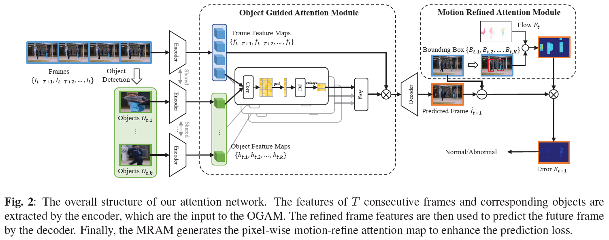

# Object-Guided and Motion-Refined Attention Network for Video Anomaly Detection

It is implemented in PyTorch, please follow the instructions to run the code.




## Training

Download the pre-trained models from [YOLO v5](https://github.com/ultralytics/yolov5) and [FlowNet2.0](https://github.com/NVIDIA/flownet2-pytorch) and move the pretrains to `./yolov5/weights` folder and `./flownet2` folder respectively. 

It is highly recommended to extract ROI and calculate optical flow to the start of the training phase. Running the script (take the training set of ped2 dataset as an example): 

```bash
getROI.py --gpu 0 --datadir PED2_TRAIN_FRAMES_PATH --datatype ped2 --save_path ./bboxes/ped2/train/
```

  ```bash
getFlow.py --gpu 0 --datadir PED2_TRAIN_FRAMES_PATH --save_path ./flow/ped2/train/
  ```

Then you can start training by running the following script:

```bash
train.py --config configs/ped2.yaml --gpu 0
```

In the `*.yaml` file, you can change the `dataset_path` and `save_path` to your own options.


## Evaluating on saved models

Take ped2 dataset as an example: 

```bash
evaluate.py --datadir PED2_TEST_FRAMES_PATH --dataset ped2 --weight WEIGHT_PATH --gpu 0
```

